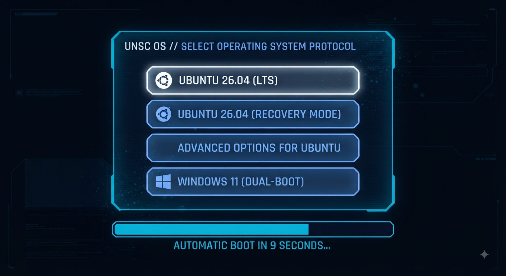

# UNSC Cortana GRUB2 Theme (Horizontal Cards + Circular Action Buttons)

Tema GRUB2 kustom bertema **UNSC** dan hologram **Cortana** (*Halo*), dioptimalkan untuk **Ubuntu 26.04** dengan **dua baris**: baris pertama berisi kartu pemilihan OS secara horizontal, dan baris kedua berisi **3 tombol berbentuk bulat kecil** untuk fungsi **Reboot (R)**, **Shutdown/Halt (S)**, dan **Boot to UEFI (U)**.

## Preview Tampilan


## Fitur Utama
- **Horizontal OS Cards:** Menu boot berbentuk kartu berdampingan.
- **Circular Action Buttons:** 3 tombol bundar kompak di baris bawah untuk kontrol daya sistem (Reboot, Shutdown, UEFI).
- **Ubuntu 26.04 Ready:** Desain antarmuka holografik futuristik yang kompatibel dengan resolusi tinggi.

---

## Cara Pemasangan (Installation Guide)

1. **Salin Folder Tema**
   Pindahkan folder tema ini ke direktori GRUB di sistem Linux Anda:
   ```bash
   sudo cp -r unsc_cortana_buttons /boot/grub/themes/
   ```

2. **Generate File Font `.pf2`**
   ```bash
   sudo grub-mkfont -o /boot/grub/themes/unsc_cortana/UnscFont.pf2 /usr/share/fonts/truetype/dejavu/DejaVuSans-Bold.ttf --size=16
   ```

3. **Konfigurasi File `/etc/default/grub`**
   ```bash
   sudo nano /etc/default/grub
   ```
   Tambahkan baris berikut:
   ```bash
   GRUB_GFXMODE=1920x1080,auto
   GRUB_GFXPAYLOAD_LINUX=keep
   GRUB_TIMEOUT_STYLE="menu"
   GRUB_TIMEOUT="10"
   GRUB_THEME="/boot/grub/themes/unsc_cortana_buttons/theme.txt"
   ```

4. **Perbarui GRUB**
   ```bash
   sudo update-grub
   ```
